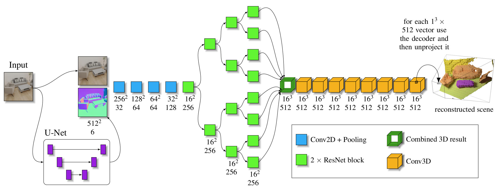

# SemanticSingleViewReconstruction

## 3D Semantic Scene Reconstruction from a Single Viewport

Maximilian Denninger and Rudolph Triebel

Accepted paper at IMPROVE 2023. [paper](MISSING_LINK)

## Overview

<p align="center">

</p>

### Abstract

We introduce a novel method for semantic volumetric reconstructions from a single RGB image. To overcome
the problem of semantically reconstructing regions in 3D that are occluded in the 2D image, we propose to
combine both in an implicit encoding. By relying on a headless autoencoder, we are able to encode semantic
categories and implicit TSDF values into a compressed latent representation. A second network then uses
these as a reconstruction target and learns to convert color images into these latent representations, which get
decoded after inference. Additionally, we introduce a novel loss-shaping technique for this implicit representation. In our experiments on the realistic benchmark Replica-dataset, we achieve a full reconstruction of a
scene, which is visually and in terms of quantitative measures better than current methods while only using
synthetic data during training. On top of that, we evaluate our approach on color images recorded in the wild.

### Network overview

<p align="center">

</p>

### Content description 

This repository contains the models used to reproduce the main results presented in the paper.
We also include the code to generate the data and train the models.

### Quick start

If you just want to test this method on your images, only a few steps are necessary to do that:

Head over to the [Setup section](svr/README.md), install the conda script, start the server and wait for the prediction.

## Citation
If you find our work useful, please cite us with: 

```
@inproceedings{denninger2022,
  title={3D Semantic Scene Reconstruction from a Single Viewport},
  author={Denninger, Maximilian and Triebel, Rudolph},
  booktitle={Proceedings of the 3rd International Conference on Image Processing and Vision Engineering (IMPROVE)},
  year={2022}
}
```

## Train your own network

Everything you need to retrain these methods with your own data is provided in this repository.
Before you can start with the training you need to generate the data, which is nearly completely automatized. 
For this head over to [data generation](data_generation/README.md).
After you generate the data you need for the network you want to retrain, head over to the specific network: 

* [U-Net for the surface normals](svr/u_net_normal/README.md)
* [Implicit TSDF point cloud compression](svr/implicit_tsdf_decoder/README.md)
* [Full 3D Scene Reconstruction](svr/scene_reconstruction/README.md)

Be aware that the data generation takes roughly 15.000 GPU hours and needs around 15 TB of storage space. 
