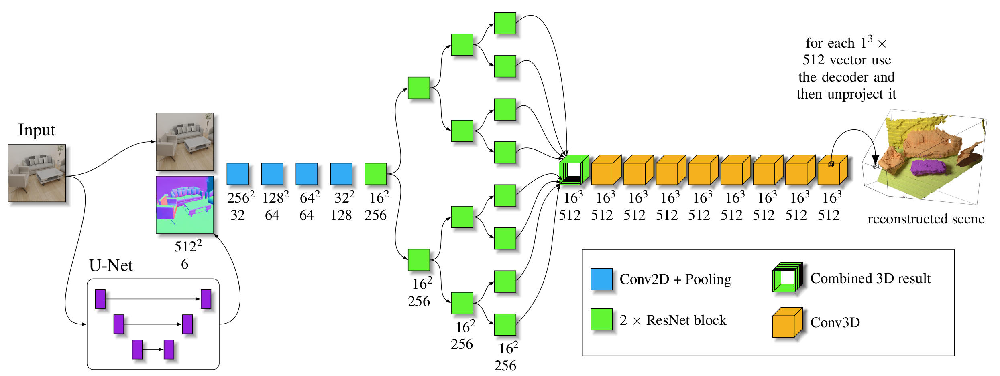
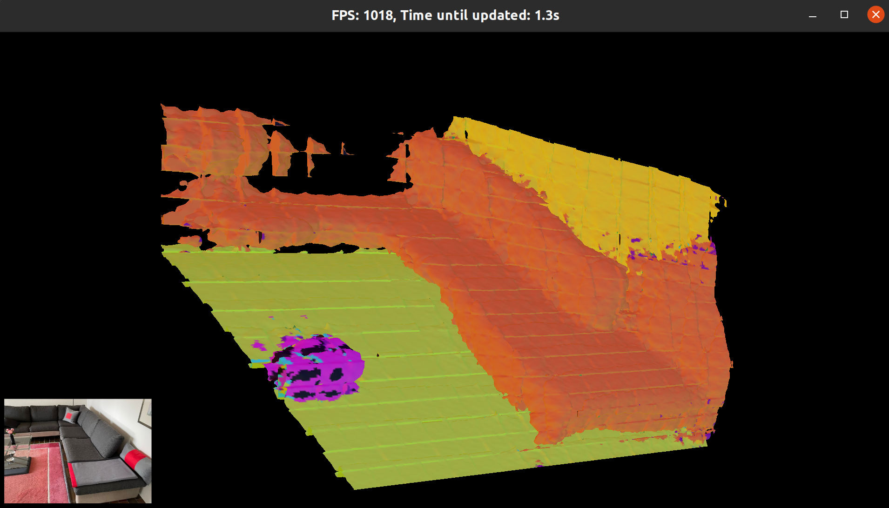

# Setup and run the Semantic Scene Reconstruction Network

This README explains how to predict a 3D scene for a single color image.
All commands are to be executed in the main directory.

## Conda

At first, you need to install the conda environment:

```shell script
conda env create -f SemanticSVR.yaml
``` 

## Download the models

Execute the download script, this will create the `trained_models` folder.

```shell script
conda activate SemanticSVR
python download_models.py
```

## Start the Server 

We provide one script, which starts a scene reconstruction server, which automatically runs all steps shown in: 

<p align="center">

</p>

One can try to reconstruct a scene with the `all_in_one_client.py` script, or one can directly visualize the results with our visualization script.


```shell script
conda activate SemanticSVR
python svr/all_in_one_server.py
``` 

This server will be started on the port: `3163`

## Produce a 3D .obj file of a scene

Now, if we would want to predict an `.obj` file containing a mesh, we can use our `all_in_one_client.py` script.
Be aware that all demo images are already cropped and prepared for the network, if you want to use your own please read the section below.
In a different terminal, while the server is running, start the `all_in_one_client.py`:

```shell script
conda activate SemanticSVR
python svr/all_in_one_client.py demo/bed_front.jpg demo_output/bed_front.obj 
``` 

If you add the `--add_image` option the object is colored not according to the categories but according to the input color image. 
Be aware that the first prediction takes much longer than any of the following prediction as the compilation of the network takes quite some time.

## Directly visualize the result

<p align="center">

</p>

To visualize the output you can use the `visualize_tsdf` script, it uses the images in the demo folder and predicts using the server a 3D reconstruction.
The following command exists: 
```
t - changes the texture between image, classification, and the normals of the surfaces
u - switching between projected and unprojected view
o - brings the camera back to the origin
wasd and mouse - for game like movement in the scene.
```

After the scene loads you might need to press `o` for origin to center the camera again.
Be aware that the first prediction takes much longer than any of the following prediction as the compilation of the network takes quite some time.

```shell script
conda activate SemanticSVR
python svr/tsdf_renderer/visualize_tsdf.py 
```

## Using your own images

If you want to use your own images you have to change the focal length of the image. Our method was only trained on images with an opening angle of 57.30 x 44.56 degree.
If your image has an opening angle smaller than this, this will fail.
Let's assume you have recorded some images on your phone (iPhone 14 Pro main camera), then you would need to google the focal length of that phone, which is 24.0 mm.

```shell script
conda activate SemanticSVR
python map_image_to_correct_opening_angle.py YOUR_IMAGE_PATH.jpg --focal_length_full_format 24.0
```

If you don't know the focal length on a full format sensor, you can also use the opening angle in horizontal and vertical direction.
For example the Xtion Pro uses 58.0 degree as horizontal and 45.0 degree as vertical opening angle.

```shell script
conda activate SemanticSVR
python map_image_to_correct_opening_angle.py YOUR_IMAGE_PATH.jpg --opening_angle_in_horizontal_deg 58.0 opening_angle_in_vertical_deg 45.0
```

We lastly also offer the option to rely on the focal value in the K matrix. For this you can average the values `K[0, 0]` and `K[1, 1]`.

```shell script
conda activate SemanticSVR
python map_image_to_correct_opening_angle.py YOUR_IMAGE_PATH.jpg --focal_value 637.0
```

The mapped images can be used then the same way as the images in the demo folder.